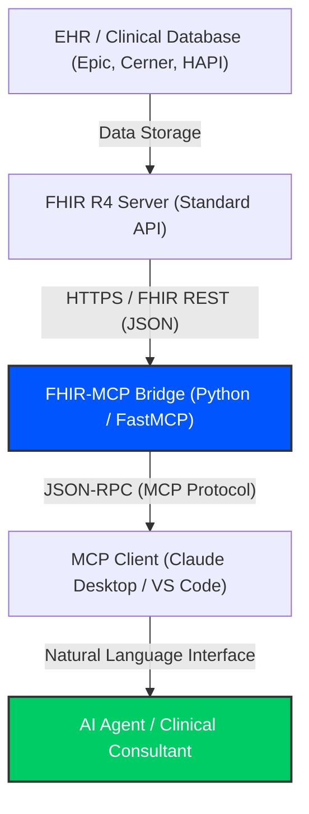

# From Data Silos to Patient Insights in 30 Minutes: Revolutionizing Clinical AI Interoperability

## Commercial Case Study

**Situation:**
In the modern healthcare landscape, approximately 80% of critical clinical data remains fragmented and "trapped" within heterogeneous Electronic Health Record (EHR) systems. While the FHIR (Fast Healthcare Interoperability Resources) R4 standard has significantly improved technical accessibility, a severe gap persists between raw data availability and the ability of generative AI agents to consume, synthesize, and reason over that data in a real-time clinical context.

**Complication:**
Traditional clinical AI integration is characterized by a heavy "Data Silo" tax. Large hospital networks typically face integration costs ranging from **$100,000 to $500,000** per project, with implementation timelines stretching between **4 to 9 months**. This friction is primarily driven by the manual technical debt of building custom API wrappers, mapping vendor-specific extensions (e.g., Epic vs. Cerner nuances), and ensuring clinical terminology systems (ICD-10, SNOMED CT, LOINC) are correctly interpreted by LLMs that lack native medical metadata awareness.

**Resolution:**
The FHIR-MCP Healthcare Data Bridge, developed by Dr. Piyush Sharma, eliminates this bottleneck by implementing the **Model Context Protocol (MCP)**. This solution acts as a standardized, stateless gateway that transforms complex clinical FHIR resources into native "tools" for AI agents. By integrating embedded terminology intelligence, the bridge allows AI models to perform multi-resource searches (Patients, Conditions, Medications, etc.) using natural language queries. This bypasses the need for manual data mapping, allowing an agent to instinctively understand clinical data structures out-of-the-box.

**Impact:**
The deployment of the FHIR-MCP Bridge delivers a transformative shift in healthcare business development and clinical informatics:
*   **90% Reduction in Integration Time:** Transitioning from months of custom engineering to a 30-minute deployment model.
*   **Immediate ROI for Consulting:** Enables rapid prototyping of clinical AI solutions against Epic and Cerner sandboxes without the $100k+ entry cost.
*   **High-Fidelity Clinical Insights:** Empowering stakeholders to query population-level health gaps (e.g., "Identify patients with uncontrolled Type 2 Diabetes missing an A1c test") via a simple conversational interface.
*   **Stateless Security:** A zero-PHI-retention architecture that ensures patient data privacy is maintained while providing maximal AI utility.

## System Architecture

**Repository Reference:** [https://github.com/basebattle/FHIR-MCP-data-bridge.git](https://github.com/basebattle/FHIR-MCP-data-bridge.git)
